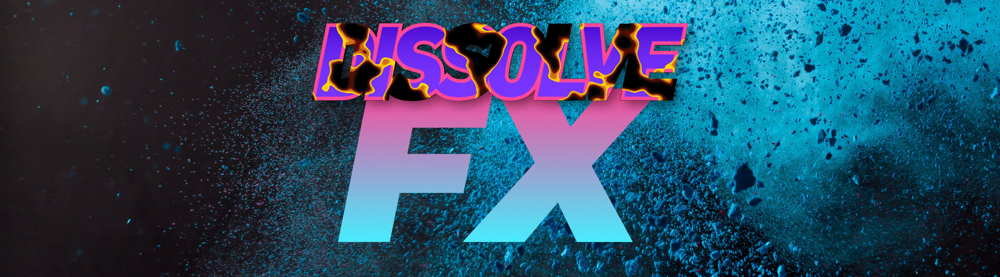
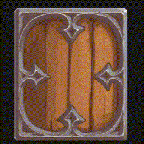

[](https://github.com/indiesoftby/defold-dissolve-fx)

# Dissolve FX for Defold

This is an example of implementing the dissolve effect for sprites for the Defold game engine.



> [!NOTE]
> Use [FastNoiseLite](https://github.com/Auburn/FastNoiseLite) to generate an unique and cool noise texture!

## Quick Start

1. Add this project as a [Defold library dependency](http://www.defold.com/manuals/libraries/). Open your `game.project` file and in the dependencies field under project add:

https://github.com/indiesoftby/defold-dissolve-fx/archive/main.zip

2. Next, add a texture to sprite's atlas: `noise`. The noise will be used to animate sprite's dissolve.
3. Set `dissolve_fx/materials/sprite.material` as the material of the sprite.
4. Do some magic in your script:

```lua
local dissolve_fx = require("dissolve_fx.dissolve_fx")

function init(self)
    dissolve_fx.init("#sprite", "noise", 1) -- args: sprite component with dissolve material, noise image name, a scale of the noise texture.
    go.set("#sprite", "dissolve.z", 0.25) -- size of the fire. Adjust subjectively to your eye!
    go.set("#sprite", "glow_color", vmath.vector4(0.8, 0.5, 0.1, 0)) -- color of the fx (R 1.0, G 0.5, B 0.0 - default value)
    go.set("#sprite", "dissolve.w", 0.0) -- to control the fx, 0.0 - 1.0, (0.0 is turn off, doesn't calculate in the shader)

    -- Play the FX in the loop
    go.animate("#sprite", "dissolve.w", go.PLAYBACK_LOOP_PINGPONG, 1, go.EASING_LINEAR, 3)
end
```

## Credits

This project and all included assets are licensed under the terms of the CC0 1.0 Universal license. It's developed and supported by [@aglitchman](https://github.com/aglitchman). The shader mod: [@Dragosha](https://github.com/Dragosha)
